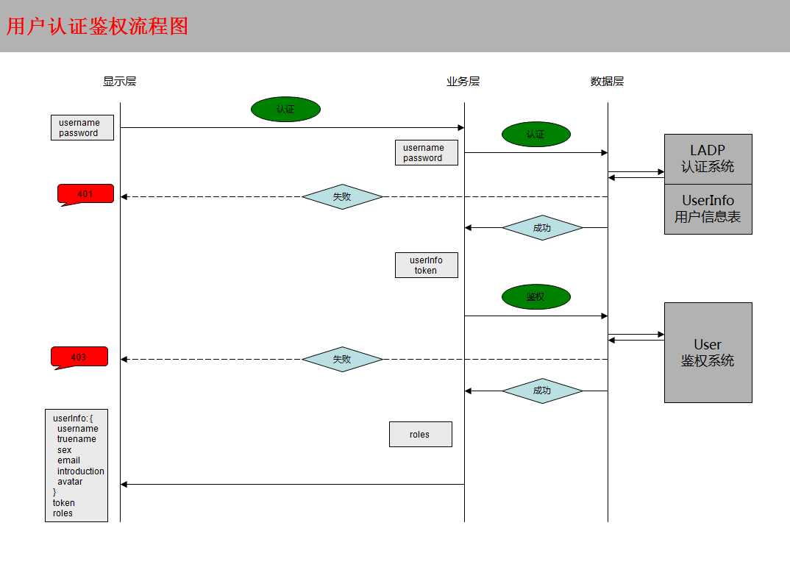

# svnlab项目

## 1 概念

## 2 用户

### 2.1 用户角色与权限

> 本系统设定下列用户角色，具备不同的权限，权限由前端路由控制

| 权限 |   标识   | 角色      | 职责       |
| ---- | ---- | --------- | ---------- |
|      | 0 | Guster    | 访客       |
| r    | 1 | Reporter  | 测试       |
| rw   | 3 | Developer | 开发       |
|      |      | Master    | 项目管理员 |
|      |      | Owner     | 系统管理员 |

### 2.2 用户认证

通过用户名、密码经由公司LADP系统进行认证。

> 用户认证鉴权流程
>
> 

### 2.9 用户数据表

1.公司LADP
username
password
email

2.个人信息表新增
username
truename
sex
email
introduction
avatar
roles

3.token
token

## 9 前后端交互

* [请求: GET/POST区别](https://blog.csdn.net/u012391923/article/details/53197387)

